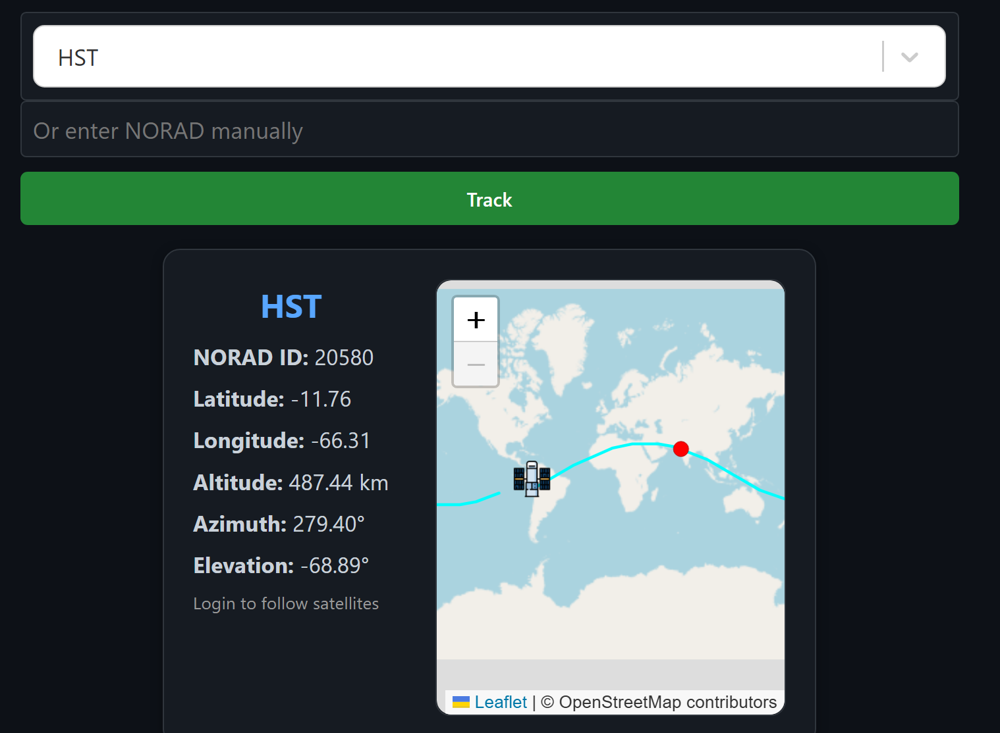

# Satellite Tracker Web App

||  |
| --- | --- |
| Satellite search and live position data view | Interactive map showing satellite trajectory |

This is a full-stack web application that enables searching, tracking, and viewing real-time position data for satellites using NORAD catalogue numbers. The application integrates the N2YO API for live satellite data and stores satellite information locally in MongoDB for faster subsequent queries. A smart search box loads known satellites from the local database, and users can manually enter NORAD IDs to fetch and persist new satellite records.

---

## Features

- Search satellites by name or NORAD ID  
- Real-time position tracking (uses the user's geolocation)  
- Local caching of satellite metadata in MongoDB for faster access  
- Automatic retrieval from N2YO when a satellite is not found locally  
- Interactive map view showing current position and trajectory  

---

## Technologies Used

- **Frontend:** React (Vite)  
- **Backend:** Node.js, Express.js  
- **Database:** MongoDB (Mongoose)  
- **APIs:** N2YO API  
- **HTTP Client:** Axios  
- **Dev / Build:** npm, Vite, nodemon (optional)

---

## Project Structure

    project-root/
    ├── client/                # React frontend (Vite)
    │   └── src/
    │       ├── components/    # Reusable components (SatCard, Search, Map, etc.)
    │       ├── api/           # Frontend API helpers (api.js)
    │       └── App.jsx
    ├── server/                # Express backend
    │   ├── models/            # Mongoose schemas
    │   ├── routes/            # API routes (satellite, search, etc.)
    │   └── server.js
    ├── assets/                # Screenshots, images used in README
    ├── .env                   # Environment variables (not committed)
    └── README.md

---

## Setup (short)

1. Clone the repository  
    (run in terminal)
    
        git clone https://github.com/your-username/satellite-tracker.git
        cd satellite-tracker

2. Install dependencies
    
        cd client && npm install
        cd ../server && npm install

3. Create `server/.env` with your values
    
        MONGO_URI=mongodb://127.0.0.1:27017/satellites
        N2YO_API_KEY=your_n2yo_api_key

4. Start servers
    
        cd server && npm run dev
        cd ../client && npm run dev

Frontend: `http://localhost:5173`  
Backend: `http://localhost:3000`

---

## Manual Satellite Entry

If a satellite is not present in the search dropdown, enter its NORAD catalogue number manually. The backend will fetch data from N2YO and save the satellite in MongoDB for future queries.

---

## How to add images (for this README)

1. Create an `assets/` folder in the project root.  
2. Save screenshots as:
   - `assets/satellite-search.png`
   - `assets/satellite-map.png`  
3. Commit and push the images together with `README.md`. The table at the top will render them side by side on GitHub.

---

## License

This project is licensed under the MIT License. See the `LICENSE` file for details.

---

## Author

Built by Jenil Patel — https://github.com/Jenil1217
